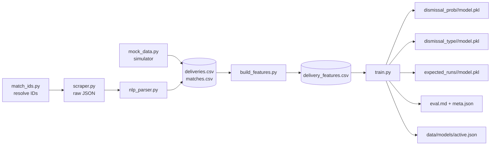
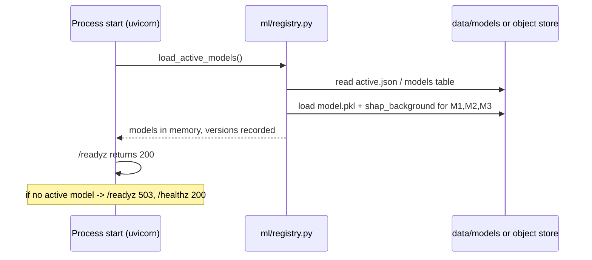
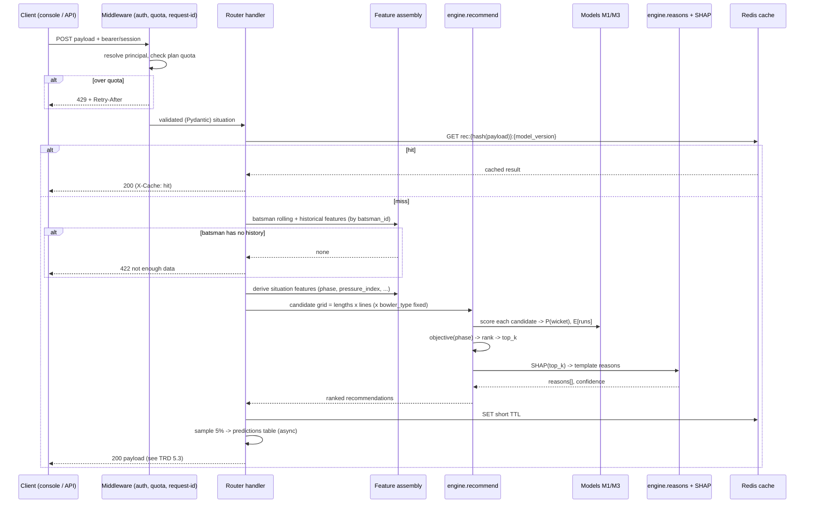
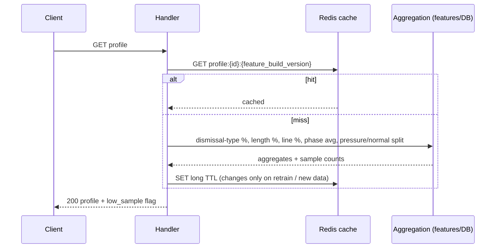
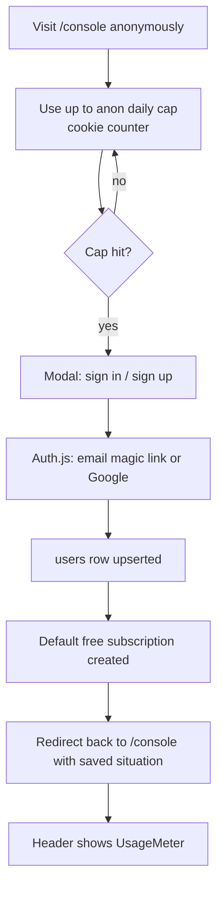
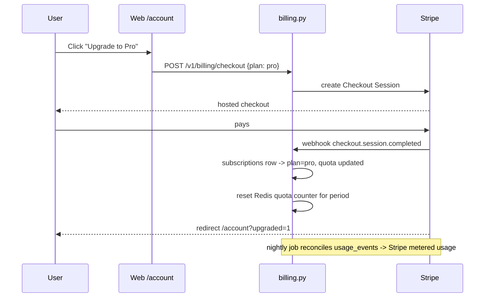
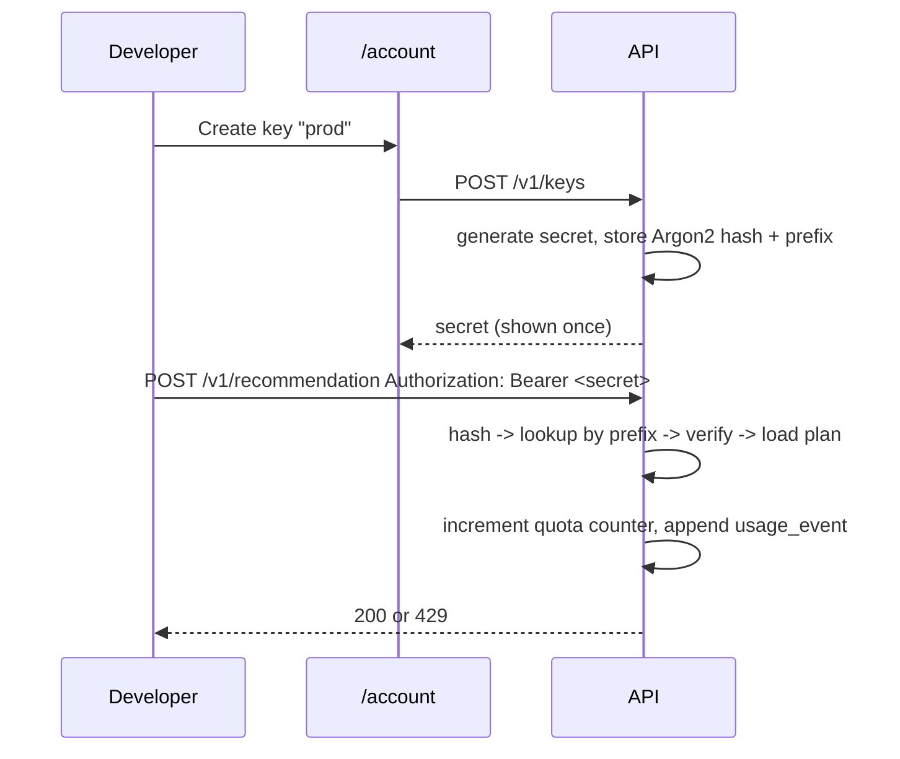
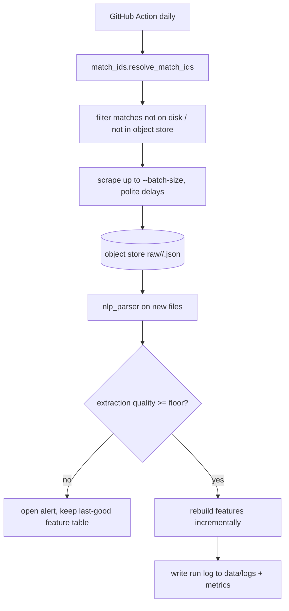

# CricXAI — App Flow

Status: Draft v1 · Last updated: 2026-08-28

Runtime flows end to end: what calls what, in what order, with the failure
branches. Build-time / offline flows first, then request-time.

---

## 1. Offline: data → features → models



Commands (mock path):
```
py -3.13 -m scripts.mock_data --num-matches 100 --seed 42
py -3.13 -m scripts.build_features
py -3.13 -m scripts.train
```
`make demo` chains these plus starting the API.

## 2. API boot



## 3. Request: `POST /v1/recommendation`



Failure branches: model not loaded → `503`; feature store unreachable →
`503` (cache may still serve); SHAP failure → return recommendation with
`reasons: []` and `confidence: "unknown"` rather than failing the whole call.

## 4. Request: `GET /v1/batsmen/{id}/profile`



Profiles are cheap to cache hard — they only change when data or the feature
build changes; cache key includes `feature_build_version`.

## 5. Onboarding / auth (Phase 5)



## 6. Upgrade / billing (Phase 5)



## 7. API key usage (Phase 5)



## 8. Scheduled scrape (Phase 2)



Training is **not** in this loop — it's a manual/monthly job that consumes
whatever the feature table currently holds.
