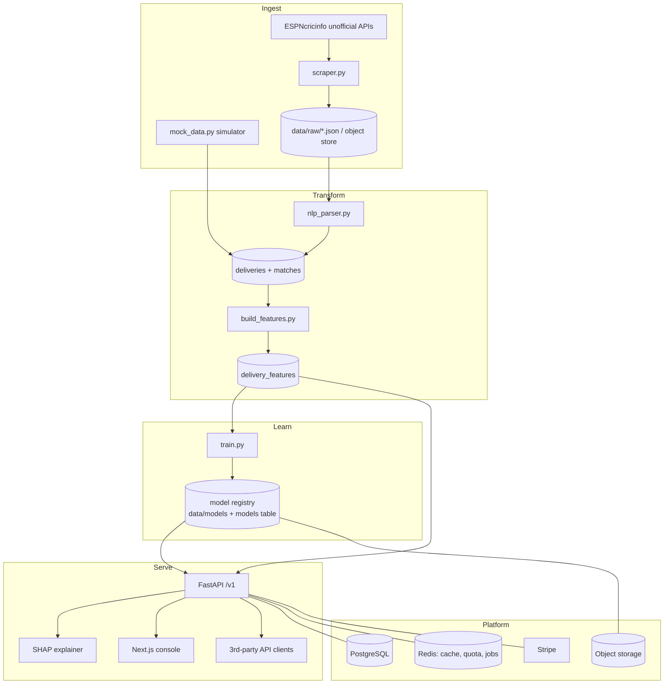
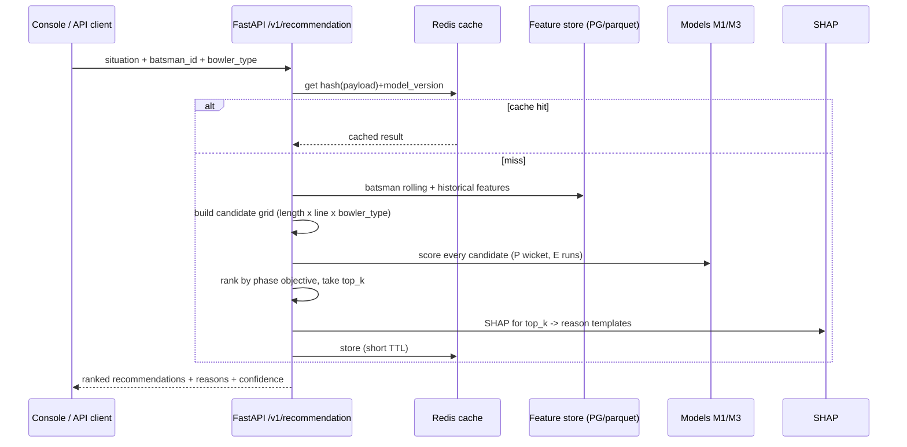
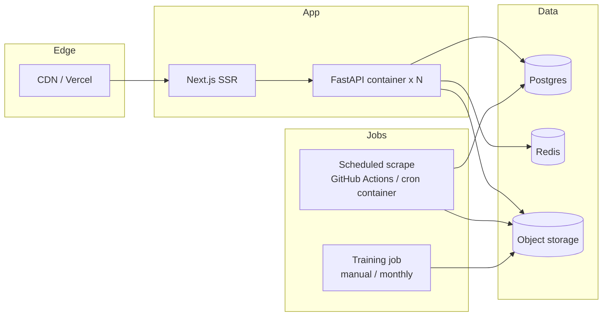

# CricXAI — Architecture

Status: Draft v1 · Last updated: 2026-08-28

---

## 1. High-level view



## 2. Components

| Component | Tech | Responsibility | State |
| --- | --- | --- | --- |
| `scripts/mock_data.py` | Python | Deterministic ODI ball-by-ball simulator for 10 teams / 100 matches; emits the same schema as the parser | **new** |
| `scripts/scraper.py` | requests | Idempotent, polite commentary scrape → raw JSON | exists |
| `scripts/match_ids.py` | requests | Resolve match IDs (API → manual fallback) | exists |
| `scripts/nlp_parser.py` | pandas | Commentary text → structured deliveries; per-field extraction-quality logging | exists |
| `scripts/build_features.py` | pandas/numpy | Leakage-free feature engineering | exists |
| `scripts/train.py` | LightGBM, sklearn, shap | Train M1/M2/M3, grouped CV, calibration, eval report, write artifacts | **new** |
| `app/engine/` | Python | Candidate-grid recommendation ranker + reason templating | **new** |
| `app/api/` | FastAPI | REST `/v1`, auth, quota, caching, SHAP endpoint | **new** |
| `app/utils/` | stdlib + yaml | logger, file IO, cricket vocabulary/encodings | exists |
| `web/` | Next.js 14 / TS | Strategy console, batsman profiles, match browser, billing | **new** |
| Postgres | — | Relational store (see BACKEND_SCHEMA.md) | **new** |
| Redis | — | Prediction cache, rate-limit + quota counters, scrape job queue | **new** |
| Object storage | S3-compatible | Raw JSON archive, model artifacts | **new** |

## 3. Data flow (runtime recommendation)



## 4. Deployment topology



- API is stateless and horizontally scalable; model loaded into each process
  at boot from object storage, version pinned by `models.active`.
- Frontend deployed separately (Vercel or Node container).
- Scrape and training are **out-of-band jobs**, never in the request path.

## 5. Directory layout

### Current
```
app/utils/          logger, file_io, cricket_constants
scripts/            match_ids, scraper, nlp_parser, build_features
tests/scripts/      offline synthetic tests
data/{raw,processed,models,logs}/
```

### Target
```
app/
  utils/            (as now)
  engine/           recommend.py, candidates.py, reasons.py, objective.py
  api/              main.py, deps.py, routers/, schemas/, security.py, billing.py
  db/               models.py (SQLAlchemy), session.py, migrations/ (Alembic)
  ml/               registry.py, features_online.py, explain.py
scripts/
  mock_data.py      squads + simulator
  train.py          M1/M2/M3
  match_ids.py scraper.py nlp_parser.py build_features.py   (as now)
web/                Next.js app (see UI_WORKFLOW.md)
deploy/             Dockerfile, docker-compose.yml, render.yaml, fly.toml
docs/               these documents
tests/
  scripts/ leakage/ models/ api/ e2e/
```

## 6. Technology choices — rationale and rejected alternatives

| Decision | Chosen | Rejected | Why |
| --- | --- | --- | --- |
| Model family | LightGBM GBDT | Neural net, logistic regression | Small tabular data; strong baselines; fast; first-class SHAP TreeExplainer |
| Probability calibration | Isotonic / Platt (`CalibratedClassifierCV`) | Raw GBDT scores | FR-3 needs calibrated probabilities for a believable UI number |
| CV strategy | Group-by-match, leave-one-tournament-out headline | Random k-fold | Random folds leak within-match context and inflate metrics |
| Recommendation | Enumerate + score candidate grid | End-to-end learned policy | Interpretable, debuggable, no counterfactual training data; grid is only ~175 cells |
| API framework | FastAPI | Flask, Django REST | Async, Pydantic typing, automatic OpenAPI |
| DB | PostgreSQL | MongoDB, SQLite-only | Relational data (players↔deliveries↔matches); analytical queries; mature |
| Feature serving | Precomputed rolling+historical in PG/parquet, situation features computed online | Full online feature store (Feast) | Overkill for current scale; revisit at Phase 5 |
| Frontend | Next.js App Router | SPA-only (Vite) | SSR for indexable batsman/match pages; API routes not needed (single `/v1`) |
| Charts | Inline SVG + visx | Chart lib only | Heatmap + field diagram are bespoke; need print + theme control |

## 7. Model lifecycle

1. `train.py` reads `delivery_features.csv` (or the feature table), runs
   grouped CV, fits final models on all data, calibrates.
2. Writes `data/models/{model_id}/{version}/` = `model.pkl`, `meta.json`
   (git SHA, data hash, feature list, params, metrics), `eval.md`,
   `shap_background.parquet`.
3. Updates `data/models/active.json` (local) / `models` table (prod) pointer.
4. API loads the `active` version at boot; a `/internal/reload` signal (or
   redeploy) swaps it. Rollback = repoint to a previous version.

## 8. Scaling notes

- **Now (mock + 1 tournament):** everything on a laptop / one small box.
- **v1 public:** 2× API containers, managed Postgres, managed Redis, object
  storage; scrape as a daily GitHub Action.
- **Growth:** move heavy analytical feature builds to DuckDB/warehouse;
  cache batsman profiles aggressively (they change only on retrain / new
  data); shard nothing yet — the dataset is small for years.

## 9. Architecture Decision Records (brief)

- **ADR-001 — Commentary text as the only signal (no ball tracking).**
  Accepted. Ball-tracking data is licensed and expensive; commentary is
  available and carries length/line/shot as prose. Cost: extraction noise,
  mitigated by quality logging and dictionary tuning.
- **ADR-002 — Leakage-free by construction, enforced by tests.**
  Accepted. Historical aggregates exclude the row's own match;
  rolling stats shift inside the group. A dedicated `tests/leakage/` suite
  guards it. See RULES.md.
- **ADR-003 — Mock data first.** Accepted. A deterministic simulator for 10
  probable-2027-World-Cup squads over 100 matches unblocks model, API, and UI
  work before live scraping is reliable/legal at scale. Mock rows are clearly
  flagged (`series_id = "MOCK"`, `data/processed/…` with a `source=mock`
  column) and never mixed into a "real" training run without a flag.
- **ADR-004 — Recommendation is a scored grid, not a learned policy.**
  Accepted. See §6.
- **ADR-005 — Single public API, dogfooded by the console.** Accepted. The
  web app calls `/v1` like any third party; no private endpoints for core
  features. Keeps the contract honest.
