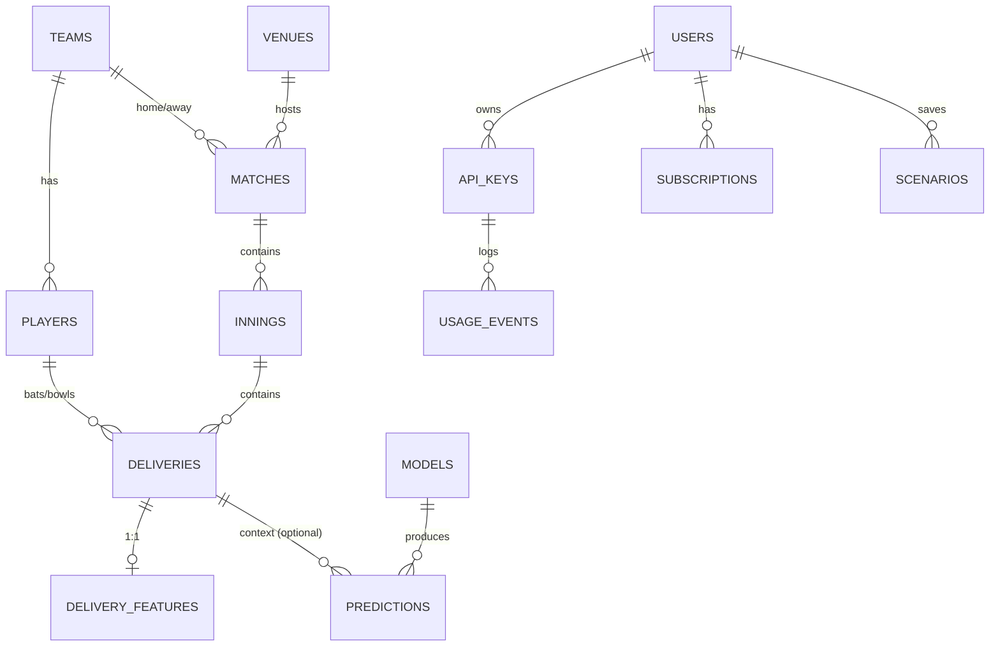

# CricXAI — Backend Schema

Status: Draft v1 · Datastore: PostgreSQL 15 · ORM: SQLAlchemy 2.0 · Migrations: Alembic
Last updated: 2026-08-28

The pipeline currently emits CSVs. This document defines the relational
schema those CSVs migrate into, plus the tables the API and billing layer
need. Until Phase 3 the CSVs remain the source of truth and these tables are
a load target; `scripts/load_db.py` (Phase 3) does `CSV → tables`.

---

## 1. Entity overview

## 2. Reference / cricket-domain tables

### `teams`
| column | type | notes |
| --- | --- | --- |
| id | text PK | slug, e.g. `india` |
| name | text | `India` |
| short_name | text | `IND` |
| is_mock | bool | true for simulator-generated squads |

### `players`
| column | type | notes |
| --- | --- | --- |
| id | text PK | `player_<n>` (mock) or ESPN objectId |
| full_name | text | |
| team_id | text FK→teams.id | current squad |
| role | text | `batter` `bowler` `allrounder` `wk_batter` |
| batting_hand | text | `right` `left` |
| bowler_type | text | one of `BOWLER_TYPES` or null |
| batting_skill | numeric | 0–1, simulator only (null for real) |
| bowling_skill | numeric | 0–1, simulator only |
| is_mock | bool | |
| Index | | `(team_id)`, `(full_name)` |

### `venues`
| column | type | notes |
| --- | --- | --- |
| id | text PK | |
| name | text | |
| city | text | |
| country | text | |

### `matches`
Maps from `matches.csv`.
| column | type | notes |
| --- | --- | --- |
| id | text PK | `match_id` |
| series_id | text | `MOCK` for simulator data |
| source | text | `mock` `scrape` `feed` |
| home_team_id | text FK→teams.id | |
| away_team_id | text FK→teams.id | |
| venue_id | text FK→venues.id | nullable |
| start_date | date | |
| result | text | free text ("India won by 4 wickets") |
| winner_team_id | text FK→teams.id | nullable |
| delivery_count | int | |
| created_at | timestamptz | default now() |
| Index | | `(series_id)`, `(start_date)`, `(source)` |

### `innings`
| column | type | notes |
| --- | --- | --- |
| id | bigserial PK | |
| match_id | text FK→matches.id | |
| innings_no | smallint | 1 or 2 |
| batting_team_id | text FK→teams.id | |
| bowling_team_id | text FK→teams.id | |
| total_runs | int | final |
| total_wickets | smallint | |
| total_overs | numeric(4,1) | |
| target | int | nullable (innings 2 only) |
| Unique | | `(match_id, innings_no)` |

### `deliveries`
Maps 1:1 from `deliveries.csv`. One row per ball.
| column | type | notes |
| --- | --- | --- |
| id | bigserial PK | |
| match_id | text FK→matches.id | |
| innings_no | smallint | |
| over | smallint | 0–49 |
| ball_in_over | smallint | 1–6 (legal-ball index as parsed) |
| batsman_id | text FK→players.id | nullable if unresolved |
| bowler_id | text FK→players.id | nullable |
| batsman_name | text | raw, pre-resolution |
| bowler_name | text | raw |
| commentary | text | source prose (nullable for mock) |
| total_runs | smallint | runs on the ball (treated as off-the-bat, see build_features docstring) |
| ball_length | text | `BALL_LENGTHS` ∪ `unknown` |
| ball_line | text | `BALL_LINES` ∪ `unknown` |
| shot_type | text | `SHOT_TYPES` ∪ `unknown` |
| outcome | text | `OUTCOMES` ∪ `unknown` |
| is_wicket | bool | |
| dismissal_type | text | `DISMISSAL_TYPES` ∪ `unknown`, null if not a wicket |
| player_out_id | text FK→players.id | nullable |
| source | text | `mock` `scrape` |
| Index | | `(match_id, innings_no, over, ball_in_over)` unique-ish; `(batsman_id)`, `(bowler_id)`, `(is_wicket)` |

### `delivery_features`
Maps 1:1 from `delivery_features.csv`. Wide table, one row per delivery,
every column leakage-free (see RULES.md). Stored as a table for the API to
read situation context and for training. Key columns (full list tracked in
`build_features.py` / TRD §3.3 DR-15):

| group | columns |
| --- | --- |
| key | `delivery_id` FK→deliveries.id (PK), `match_id`, `innings_no`, `over`, `ball_in_over`, `batsman_id`, `bowler_id` |
| phase | `phase`, `phase_encoded` |
| batsman rolling | `batsman_runs_so_far`, `batsman_balls_faced`, `batsman_strike_rate`, `batsman_dot_pct` |
| bowler rolling | `bowler_balls_bowled`, `bowler_wickets_so_far`, `bowler_economy` |
| match context | `innings_score`, `innings_wickets`, `pressure_index` |
| historical (other matches only) | `hist_dismissal_type_<type>_pct` (×6), `hist_ball_length_<len>_pct`, `hist_ball_line_<line>_pct`, `hist_phase_avg`, `hist_avg_under_pressure`, `hist_avg_normal` |
| encodings | `ball_length_encoded`, `ball_line_encoded` |
| targets | `will_dismiss`, `dismissal_type_encoded` |
| meta | `feature_build_version`, `built_at` |

> The `hist_ball_length_*` / `hist_ball_line_*` column set is data-dependent
> (built from categories present in wicket rows). Persist the exact column
> list in `feature_build_version`'s metadata so training and serving agree.

## 3. ML tables

### `models`
| column | type | notes |
| --- | --- | --- |
| id | bigserial PK | |
| model_id | text | `dismissal_prob` `dismissal_type` `expected_runs` |
| version | text | `YYYY-MM-DD.<shortsha>` |
| environment | text | `dev` `staging` `prod` |
| status | text | `candidate` `active` `retired` |
| artifact_uri | text | object-store path to `model.pkl` |
| feature_list | jsonb | ordered feature names |
| metrics | jsonb | brier, logloss, auc, macro_f1, mae … |
| data_snapshot_hash | text | hash of training feature table |
| git_sha | text | |
| created_at | timestamptz | |
| Unique | | `(model_id, version, environment)`; partial unique `(model_id, environment) where status='active'` |

### `predictions`
Optional audit log of served recommendations (sampled in prod).
| column | type | notes |
| --- | --- | --- |
| id | bigserial PK | |
| request_id | text | mirrors `X-Request-Id` |
| model_version | text | |
| api_key_id | bigint FK→api_keys.id | nullable (console/session calls) |
| situation | jsonb | full request payload |
| result | jsonb | ranked recommendations + reasons |
| latency_ms | int | |
| created_at | timestamptz | |
| Index | | `(created_at)`, `(api_key_id)` |

## 4. Account / billing tables

### `users`
| column | type | notes |
| --- | --- | --- |
| id | uuid PK | |
| email | citext unique | |
| name | text | |
| auth_provider | text | `email` `google` |
| created_at | timestamptz | |
| deleted_at | timestamptz | soft delete for GDPR |

### `api_keys`
| column | type | notes |
| --- | --- | --- |
| id | bigserial PK | |
| user_id | uuid FK→users.id | |
| name | text | user label |
| key_hash | text | Argon2/bcrypt of the secret; secret shown once |
| key_prefix | text | first 8 chars, for display/lookup |
| scopes | text[] | e.g. `{recommendation, profiles}` |
| last_used_at | timestamptz | |
| revoked_at | timestamptz | |
| Index | | `(user_id)`, `(key_prefix)` |

### `subscriptions`
| column | type | notes |
| --- | --- | --- |
| id | bigserial PK | |
| user_id | uuid FK→users.id | |
| plan | text | `free` `pro` `analyst` `business` |
| status | text | `active` `past_due` `canceled` `trialing` |
| stripe_customer_id | text | |
| stripe_subscription_id | text | |
| current_period_end | timestamptz | |
| monthly_call_quota | int | denormalized from plan for fast checks |
| Index | | unique `(user_id)` where status in ('active','trialing') |

### `usage_events`
| column | type | notes |
| --- | --- | --- |
| id | bigserial PK | |
| api_key_id | bigint FK→api_keys.id | nullable for console calls |
| user_id | uuid FK→users.id | |
| endpoint | text | |
| units | int | usually 1; bulk endpoints > 1 |
| billing_period | date | first day of period, for aggregation |
| created_at | timestamptz | |
| Index | | `(user_id, billing_period)`, `(api_key_id, created_at)` |

Live quota counters live in Redis (`quota:{user_id}:{period}`), flushed to
`usage_events` for durable billing and reconciled against Stripe metered
usage records nightly.

### `scenarios`
| column | type | notes |
| --- | --- | --- |
| id | uuid PK | |
| user_id | uuid FK→users.id | |
| title | text | |
| payload | jsonb | the saved situation |
| last_result | jsonb | cached recommendation snapshot |
| created_at / updated_at | timestamptz | |
| Index | | `(user_id, updated_at desc)` |

## 5. CSV → table mapping

| CSV | Table(s) | Loader |
| --- | --- | --- |
| `data/processed/matches.csv` | `matches` (+ derive `teams`, `venues`) | `scripts/load_db.py --matches` |
| `data/processed/deliveries.csv` | `deliveries` (+ `innings` aggregate, + resolve `players`) | `scripts/load_db.py --deliveries` |
| `data/processed/delivery_features.csv` | `delivery_features` | `scripts/load_db.py --features` |
| `data/models/*/*/meta.json` | `models` | `scripts/register_model.py` |

Player/name resolution: mock data already uses stable `player_<n>` ids;
scraped data resolves `batsman_name`→`players.id` via a name-match table
(Phase 3), leaving `batsman_id` null when ambiguous.

## 6. Retention & privacy

- Cricket-domain tables: retained indefinitely, no PII.
- `predictions`: sampled at 5% in prod, 90-day retention.
- `usage_events`: 24 months (billing/audit).
- `users` GDPR delete: set `deleted_at`, null `email`/`name`, cascade-delete
  `api_keys` and `scenarios`; billing history retained per legal requirement
  with user reference anonymized.
